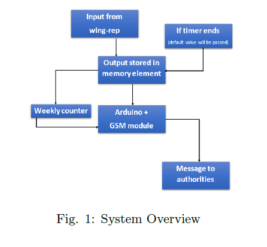
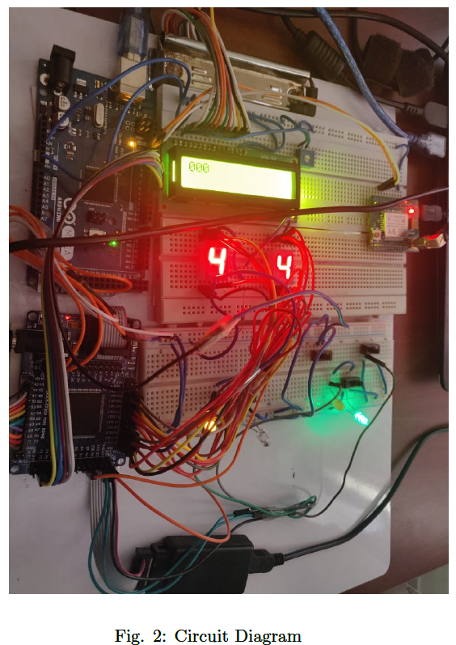
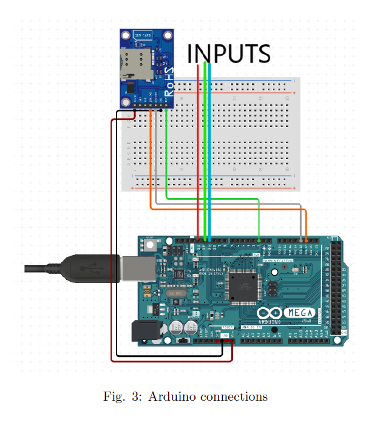

# Cleanliness Monitoring System

## Introduction

The current maintenance council intends to have a monitoring
system that will keep an eye on the punctuality of the clean-
ing staff also will assist them in keeping a record. For the ease
of demonstration, we have reduced down the day duration to
10 secs. The designed system takes yes or no inputs from two
wings daily. The system also has LEDs for each wing which
will change color as soon as the wing is cleaned, this will help
the cleaning staff in identifying the uncleaned wings. The
weekly record of the wings will be sent to the Maintenance
Secretary who will take the further required actions.

## System Overview

Input System:
The system takes input through push button and the input
is stored in different variables. Two LEDs Red and Green are
connected to the input. The input is set to ‘0’ by default(for
each day) and Red LED is kept ON when the input value
is set to ‘1’ the Red LED will turn OFF and the Green one
would light up.

Display System:
This part consists of a central clock that counts down daily
and also displays the present day (1-Monday, 2-Tuesday....
etc) on an LCD display and a counter which counts the num-
ber of times input is given in the ongoing week and displays
it on a seven-segment display. At the end of each week, the
weekly counter resets itself back to ‘0’.

Transmission System:
The system takes the count as 3-bit binary digits from the
FPGA board and is used as input for the variables in the Ar-
duino board which then sends the message according to the
variables and number fed in the GSM module.

## Implementation Details

Input System:
The input(from WR) is directly considered as
Green(implying that cleaning is done) and the default for
Red(Cleaning not done).

Display System:
To display day and the central clock we have used BCD
counters (with different reset signals), up and down respec-
tively as developed during the lab session which counts up
from ‘0’ to ‘9’, and down from ‘9’ to ‘0’ respectively.

Transmission System:
The counted inputs are converted from integers to
stdlogicvectors of 3-bit and each bit is transmitted individ-
ually to the Arduino board for each input and then converted
back to integer values and fed as input to the three vari-
ables,for the wing and the GSM module uses these variables
and the message is then sent accordingly.

## Results

The system sends the number of days cleaning has taken place
for two different inputs i.e two different wings A and B to the
concerned assigned phone number.

## Conclusion

The project’s working has nearly met our expectations and
we have thoroughly enjoyed our time exploring new devices
and understanding their working. We hope this project meets
some real-life applications in future in some or other way and
solve the issues it’s making was intended for.

## References

[1] https://lastminuteengineers.com/a6-gsm-gprs-module-arduino-tutorial/

[2] https://www.arduino.cc/en/Tutorial/HomePage?from=Main.Tutorials

[3] https://www.circuito.io/app?components=512

